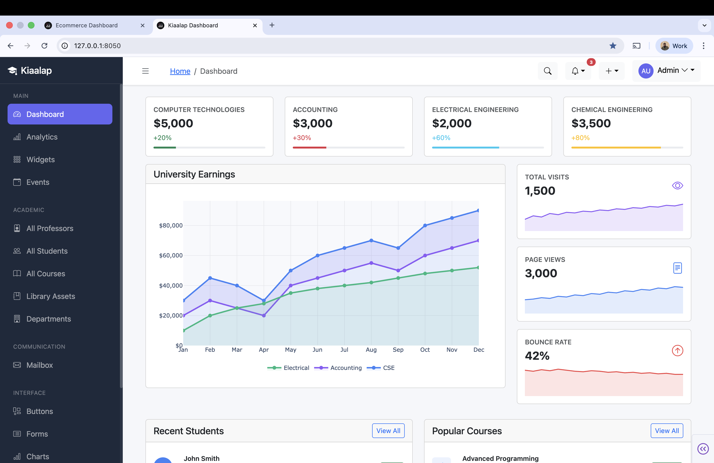
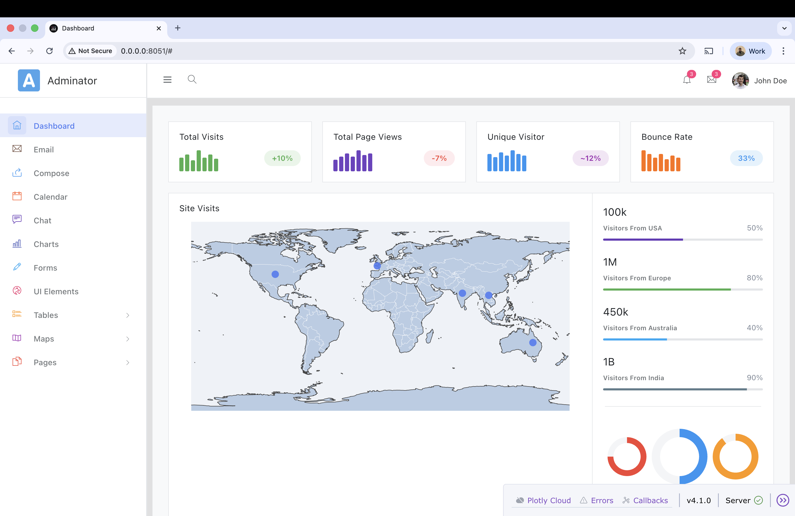
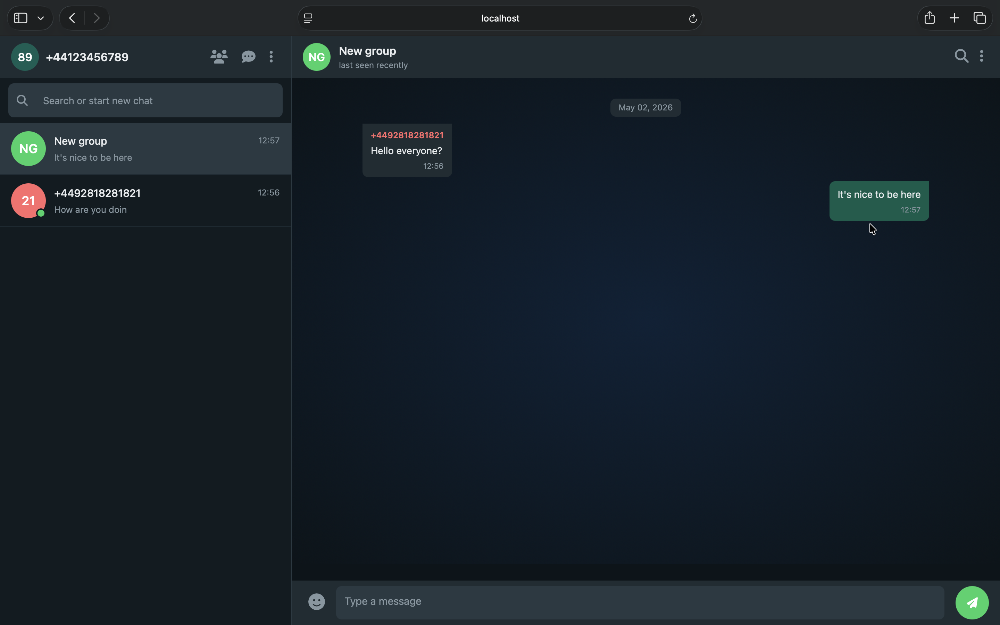
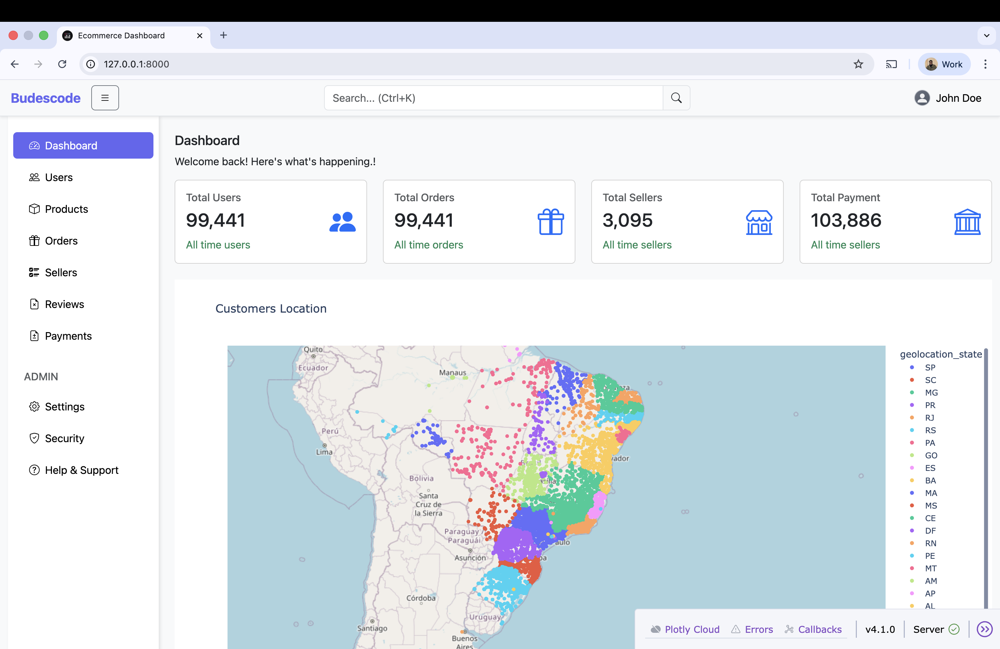
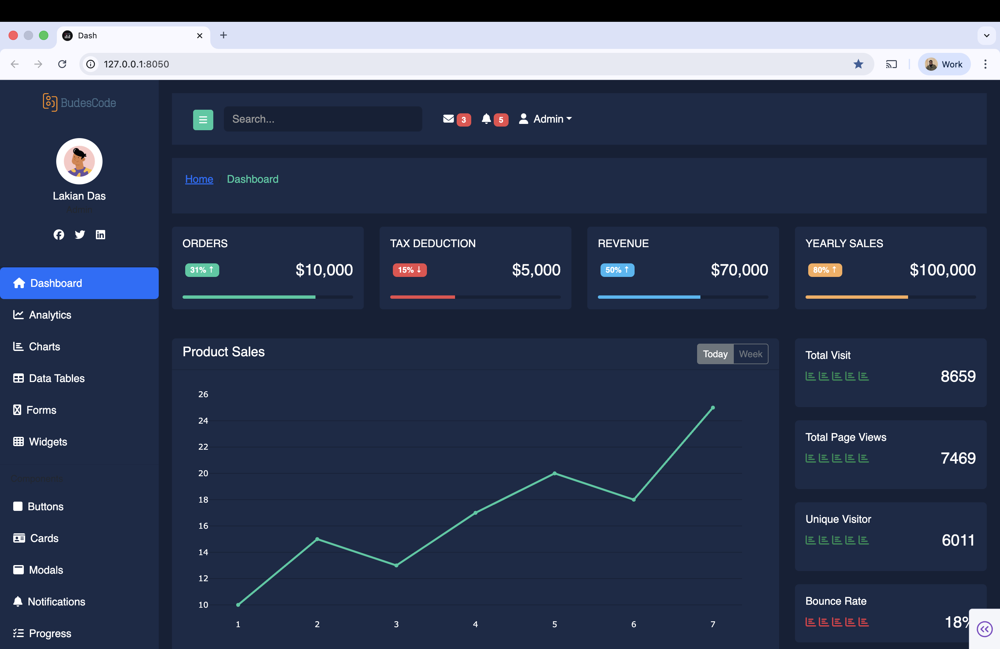

# Dash Admin Dashboards

A growing collection of open-source admin dashboard templates, reimagined and rebuilt in **Plotly Dash** with Python. New dashboards are added **weekly**.

## What This Is

Popular HTML/Bootstrap admin templates from across the web — rebuilt as fully interactive, production-ready **Dash applications**. Each dashboard preserves the original design while replacing static HTML with dynamic Python/Dash components, Plotly charts, and real callback interactivity.

---

## Dashboards

| Dashboard | Theme | Specialty | Port | View |
|-----------|-------|-----------|------|------|
| [Dash-Kiaalap](dash-kiaalap/) | Light / Indigo | Education management | 8050 | [Live](https://eea22046-514c-4815-9ae2-f1693ded335a.plotly.app/) |
| [Dash-Admin](dash-admin-dashboard/) | Light / Modern | General admin | 8051 | [Live](https://09143eb7-503a-475d-8ca4-a2477c8cdce0.plotly.app/) |
| [WhatsApp Clone](whatsapp-clone/) | Dark / Green | Real-time messaging | 8050 | — |
| [Dash Ecommerce Admin](dash-ecommerce-admin/) | Light / Clean | E-commerce management | 8053 | — |
| [Dash-Nalika](dash-nalika/) | Dark / Professional | Analytics-focused | 8054 | [Live](https://617c364e-d98b-4e70-97ca-60a0c04f5c69.plotly.app/) |

## Dashboards in Detail

### Dash Kiaalap



> Inspiration from the Kiaalap Bootstrap admin template

The most comprehensive dashboard in the collection — an education management system with 50+ pages covering academic, administrative, and developer tooling needs.

**Live Demo:** https://eea22046-514c-4815-9ae2-f1693ded335a.plotly.app/

**Page categories:**
- **Academic** — Students, Professors, Courses, Library, Departments (full CRUD: list · add · edit · profile/info)
- **Communication** — Mailbox, Compose, View
- **UI Components** — Buttons, Alerts, Modals, Accordion, Forms (basic & advanced), Password Meter, Image Cropper, Multi-upload
- **Charts** — Line, Area, Bar (via Plotly)
- **Tables** — Static & interactive data tables
- **Maps** — Google Maps, Data Maps
- **Auth** — Login, Register, Lock, Password Recovery, 404, 500
- **Developer Tools** — Code Editor, PDF Viewer, Tree View, Preloader, Notifications

**Color palette:** `#6366f1` primary (indigo) · `#1e293b` sidebar · `#f5f7fa` background

```bash
cd dash-kiaalap
pip install -r requirements.txt
python app.py
# → http://localhost:8050
```

---

### Adminator



A clean, modern general-purpose admin dashboard with 18 fully built pages.

**Live Demo:** https://09143eb7-503a-475d-8ca4-a2477c8cdce0.plotly.app/

**Pages:** Dashboard · Email · Compose · Chat · Calendar · Charts · Basic Tables · Data Tables · Forms · UI Elements · Google Maps · Vector Maps · Sign In · Sign Up · 404 · 500 · Blank

```bash
cd dash-admin-dashboard
pip install -r requirements.txt
python app.py
# → http://localhost:8051
```

---

### WhatsApp Clone



A modern, real-time messaging application built with Dash and WebSockets. Experience instant messaging with OTP authentication, group chats, and real-time typing indicators.

**Features:** OTP Verification · One-on-One Chats · Group Chat · User Profiles · Message Search · Real-time Typing · Online Status · Message Deletion

**Tech Stack:** Flask-SocketIO · PostgreSQL · Redis · Eventlet WSGI

```bash
cd whatsapp-clone
docker compose up
# → http://localhost:8050
```

Or manually:
```bash
cd whatsapp-clone
pip install -r requirements.txt
python run.py
# → http://localhost:8050
```

---

### Dash Ecommerce Admin



An e-commerce-focused admin dashboard with modules for managing the full lifecycle of an online store.

**Pages:** Dashboard · Orders · Products · Users · Sellers · Payments · Reviews · Messages · Files · Calendar · Geo Location · Security · Settings · Help & Support

```bash
cd dash-ecommerce-admin
pip install -r requirements.txt
python app.py
# → http://localhost:8053
```

---

### Dash Nalika



> Inspiration from the Nalika Dash Admin

A dark-themed dashboard with a teal accent palette, suited for professional or corporate environments.

**Live Demo:** https://617c364e-d98b-4e70-97ca-60a0c04f5c69.plotly.app/

**Pages:** Dashboard · Analytics · Charts · Tables · Forms · Widgets · Mailbox · Cards · Profile · Buttons · Modals · Progress · Notifications · Calendar · Tabs & Accordions · Maps · Login

**Color palette:** `#152036` background · `#24caa1` accent · `#eb4b4b` danger

```bash
cd dash-nalika
pip install -r requirements.txt
python app.py
# → http://localhost:8054
```

---

## Tech Stack

All dashboards are built on the same core stack:

| Package | Purpose |
|---------|---------|
| `dash` | Web framework & routing |
| `dash-bootstrap-components` | Bootstrap 5 UI components |
| `plotly` | Interactive charts |
| `pandas` | Data handling |

Some dashboards use additional packages (e.g. `dash-ag-grid` for advanced data tables).

---

## Getting Started

**Prerequisites:** Python 3.8+

```bash
# Clone the repo
git clone https://github.com/budescode/dash-templates-hub.git
cd dash-templates-hub

# Pick a dashboard, install its dependencies, and run it
cd dash-kiaalap
pip install -r requirements.txt
python app.py
```

Each dashboard is self-contained with its own `requirements.txt` and can be run independently.

---

## Roadmap

- [x] Dash Kiaalap — Education Management Dashboard
- [x] Adminator — General Admin Dashboard
- [x] Dash Ecommerce Admin — E-commerce Dashboard
- [x] Dash Nalika — Dark Analytics Dashboard
- [x] WhatsApp Clone — Real-time Messaging Application
- [ ] New dashboard — coming this week

Dashboards are added weekly. Watch or star the repo to get notified.

---

## Contributing

Contributions are welcome. If you've rebuilt an admin template in Dash and want it included:

1. Fork the repo.
2. Add your dashboard in its own directory with a `requirements.txt` and basic `README.md` for the repo.
3. Open a pull request.

Please keep each dashboard self-contained and runnable with `python app.py`.

---

## Support

If this project has been useful to you, consider buying me a coffee — it helps keep new dashboards coming every week!

[](https://www.paypal.com/paypalme/omonbudeemma)
[](https://www.linkedin.com/in/budescode)
[](https://github.com/budescode)

---

## License

Each dashboard is either an original design or inspired by an existing admin template. The code in this repo is released under the [MIT License](LICENSE).
