# Adminator Admin Dashboard - Dash Version

A complete modern admin dashboard built with Dash and Dash Bootstrap Components, based on the open-source Adminator template.

🔗 **Live Demo:** https://09143eb7-503a-475d-8ca4-a2477c8cdce0.plotly.app/

## Features

✨ **Complete Pages & Components**
- Dashboard with statistics and charts
- Email, Compose, and Chat pages
- Calendar functionality
- Forms with validation
- UI Elements showcase (buttons, badges, alerts, etc.)
- Tables (Basic and Data Tables with DataTable component)
- Maps (Google Maps and Vector Maps placeholders)
- Authentication pages (Sign In, Sign Up)
- Error pages (404, 500)
- Blank page template


🎨 **Design**
- Bootstrap 5 styling
- Themify Icons integration
- Font Awesome icons
- Light / Dark theme toggle (preference saved in localStorage)
- Professional color palette
- Fully responsive design

## Installation

### Prerequisites
- Python 3.8 or higher
- pip (Python package manager)

### Setup Instructions

1. **Navigate to the project directory:**
   ```bash
   cd dash-admin-dashboard
   ```

2. **Create a virtual environment (recommended):**
   ```bash
   python -m venv .venv
   source venv/bin/activate  # On Windows: venv\Scripts\activate
   ```

3. **Install dependencies:**
   ```bash
   pip install -r requirements.txt
   ```

## Running the Application

### Start the development server:
```bash
python app.py
```

The application will be available at `http://localhost:8050`

### Production Deployment:

For deployment, see the official Dash deployment guide: https://dash.plotly.com/deployment

## Project Structure

```
dash-admin-dashboard/
├── app/
│   ├── __init__.py
│   ├── components/
│   │   ├── __init__.py
│   │   └── layout.py
│   └── pages/
│       ├── __init__.py
│       ├── dashboard.py
│       ├── email_chat.py
│       ├── email_compose.py
│       ├── chat.py
│       ├── calendars.py
│       ├── charts.py
│       ├── forms.py
│       ├── ui_elements.py
│       ├── tables.py
│       ├── maps.py
│       └── other_pages.py
├── assets/
│   ├── adminator.css
│   ├── style.css
│   ├── utils/
│   │   └── theme.css
│   ├── bootstrap.bundle.min.js
│   ├── adminator-interactions.js
│   ├── fullcalendar-bundle.js
│   ├── jsvectormap.min.js
│   └── static/
├── app.py
├── requirements.txt
├── pyproject.toml
└── README.md
```

## Pages & Routes

| Page | Route | Features |
|------|-------|----------|
| Dashboard | `/` | Statistics, charts, activity feed |
| Email | `/email` | Inbox list and email viewer |
| Compose | `/compose` | Email composition form |
| Chat | `/chat` | Real-time messaging interface |
| Calendar | `/calendar` | Event calendar and date picker |
| Charts | `/charts` | Multiple chart types (line, bar, pie, area) |
| Forms | `/forms` | Form elements and validation states |
| UI Elements | `/ui` | Component showcase (buttons, badges, alerts, etc.) |
| Basic Table | `/tables/basic` | HTML table with Bootstrap styling |
| Data Table | `/tables/data` | Interactive Dash DataTable with 10 rows per page |
| Google Maps | `/maps/google` | Interactive map via Plotly Scattergeo |
| Vector Maps | `/maps/vector` | Interactive vector map via Plotly Scattergeo |
| Blank | `/pages/blank` | Blank template for custom content |
| 404 Error | `/pages/404` | Page not found error page |
| 500 Error | `/pages/500` | Server error page |
| Sign In | `/pages/signin` | Login form |
| Sign Up | `/pages/signup` | Registration form |

## Customization

### Modifying Sidebar Menu
Edit the `menu` list in the `update_sidebar_menu` callback in `app.py`. Use `nav_item()` for direct links and `dropdown_item()` for expandable groups.

### Adding New Pages
1. Create a new function in `app/pages/` folder
2. Import it in `app.py`
3. Add a route in the `display_page` callback
4. Add menu item to `update_sidebar_menu` callback

Example:
```python
# In app/pages/new_page.py
def create_new_page():
    return dbc.Container([
        html.H2("New Page", className="mb-4 mt-4"),
        # Add your content here
    ], fluid=True)

# In app.py
elif pathname == "/new-page":
    return create_new_page()
```

## Dependencies

- **dash**: Web application framework
- **dash-bootstrap-components**: Bootstrap 5 components for Dash
- **plotly**: Interactive charting library
- **pandas**: Data manipulation and analysis
- **python-dateutil**: Date utilities

See `requirements.txt` for complete list with versions.

## Browser Support

- Chrome/Edge (latest)
- Firefox (latest)
- Safari (latest)
- Mobile browsers (iOS Safari, Chrome Mobile)

## Performance Tips

1. Use production mode for deployment (set `debug=False`)
2. See https://dash.plotly.com/deployment for deployment options
3. Enable caching for static assets
4. Consider using a CDN for external libraries

## Troubleshooting

### Port Already in Use
Change the port in `app.py`:
```python
app.run(debug=True, host='0.0.0.0', port=8052)
```

### Module Import Errors
```bash
# Ensure you're in the correct directory and virtual environment is activated
cd dash-admin
source venv/bin/activate  # or venv\Scripts\activate on Windows
pip install -r requirements.txt
```

### Styling Issues
- Clear browser cache (Ctrl+Shift+Delete or Cmd+Shift+Delete)
- Restart the development server
- Check that assets/style.css is being loaded

## Future Enhancements

- [ ] Database integration
- [ ] User authentication
- [ ] Real email and chat functionality
- [ ] Advanced analytics
- [ ] Export to PDF/Excel
- [ ] Real-time notifications
- [ ] Mobile app version
- [ ] API integration examples

## Screenshots

### Dashboard
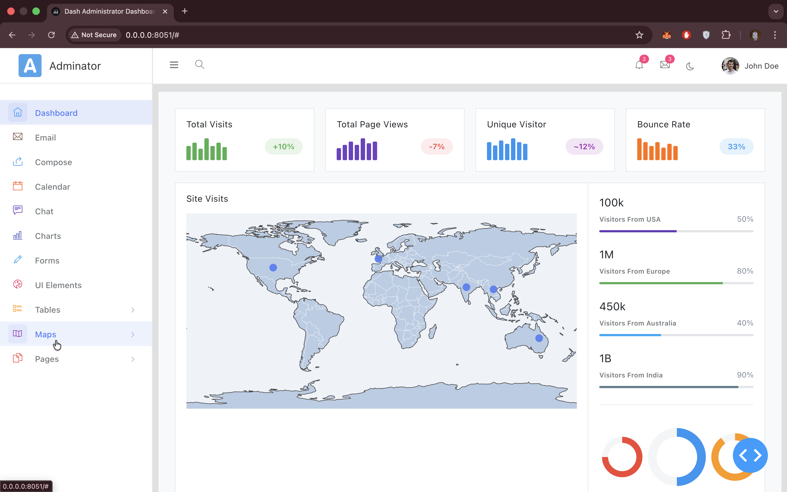

### Email
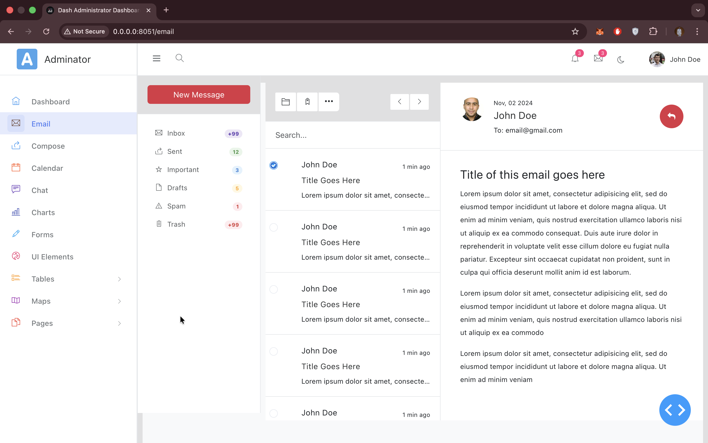

### Compose Email
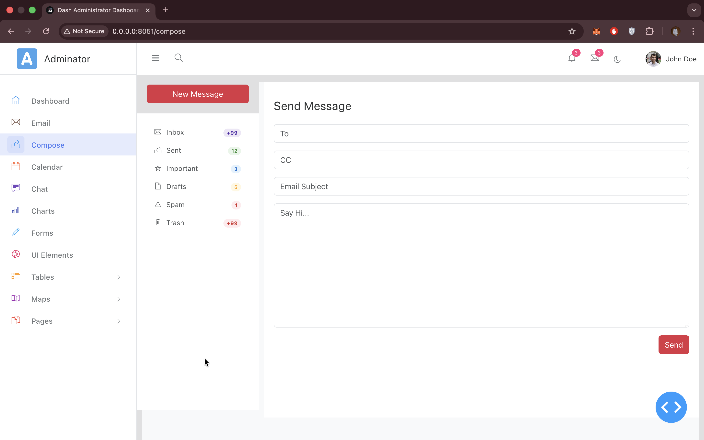

### Chat
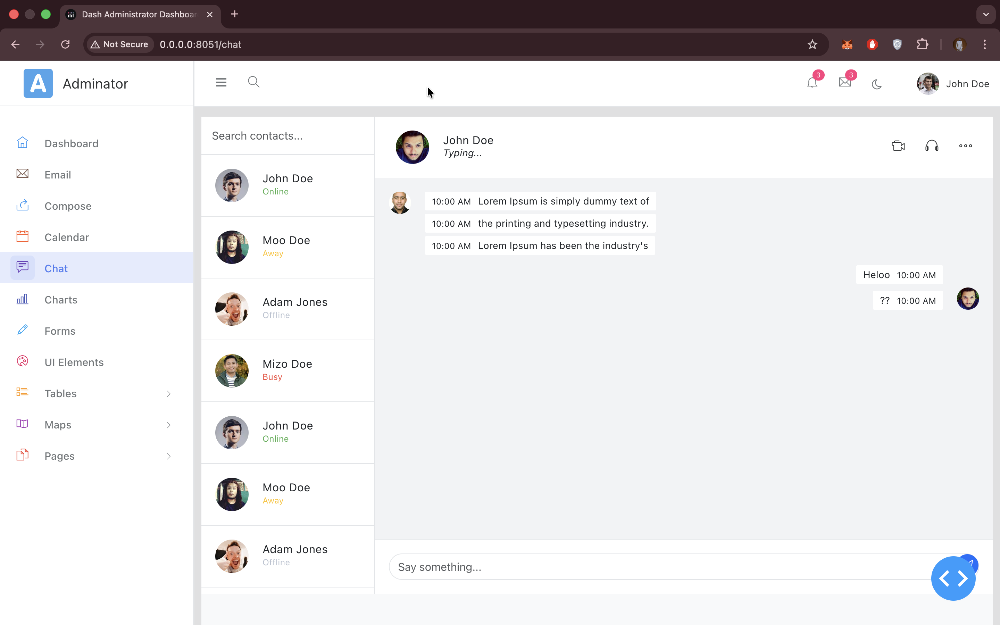

### Calendar
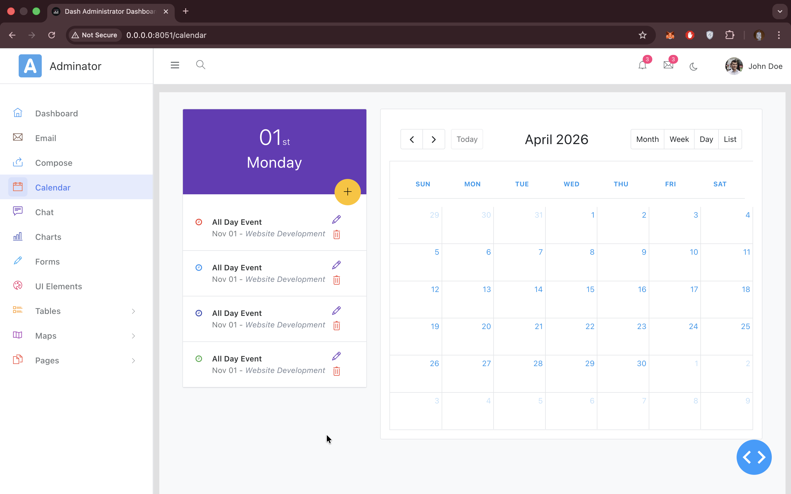

### Charts
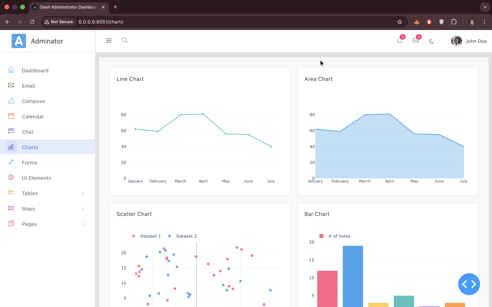

### Forms
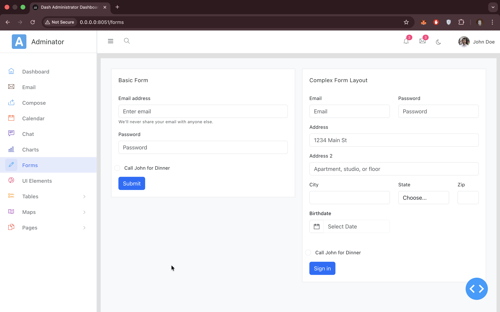

### UI Elements
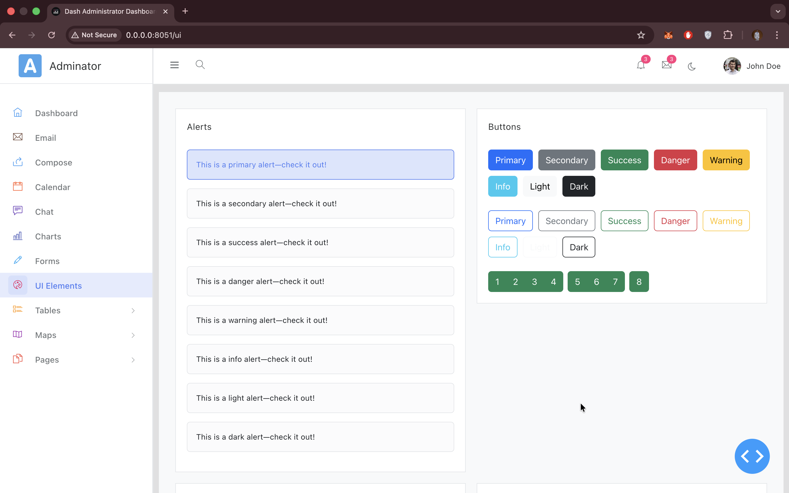

### Basic Table
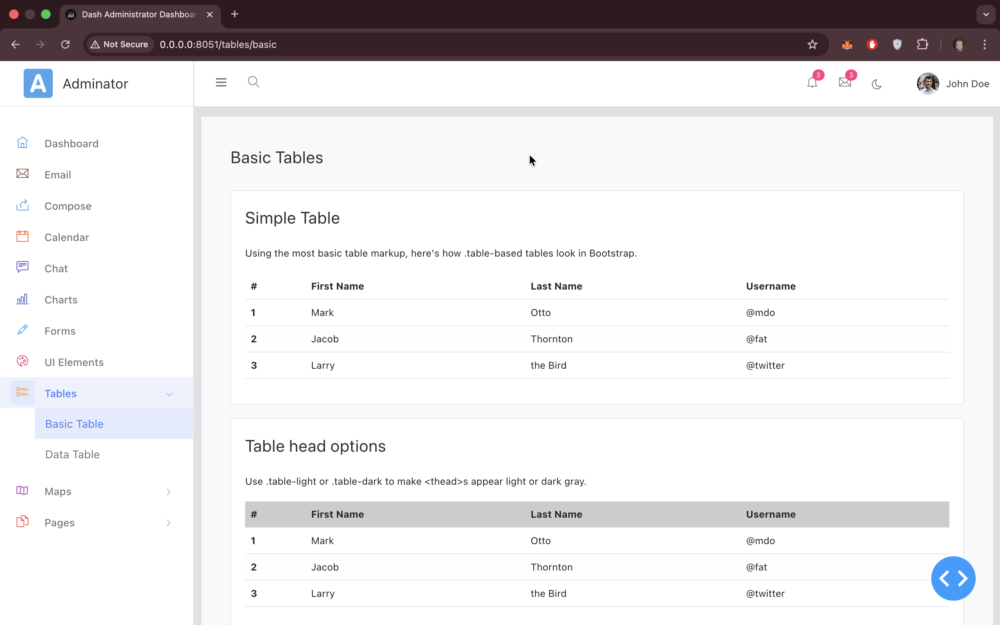

### Data Table
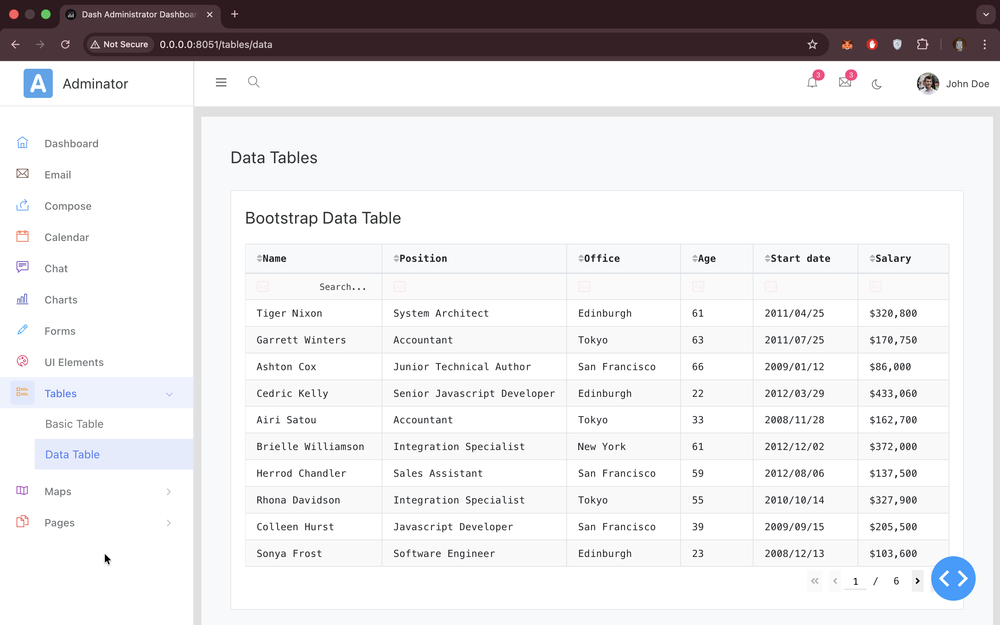

### Google Map
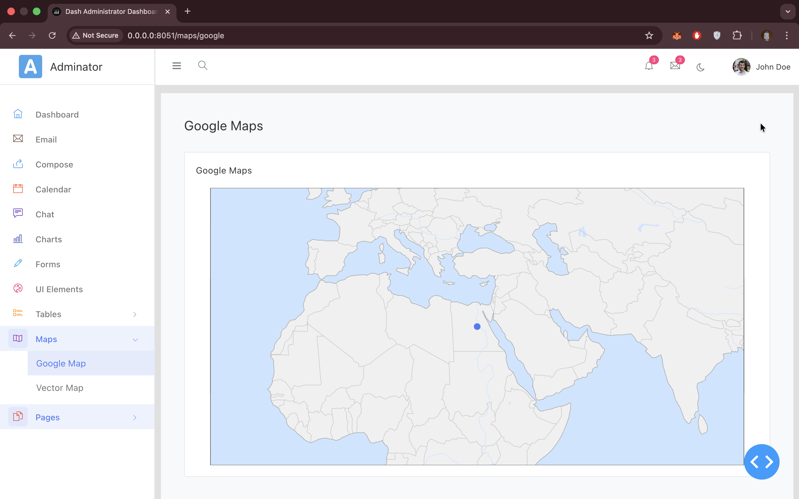

### Sign In
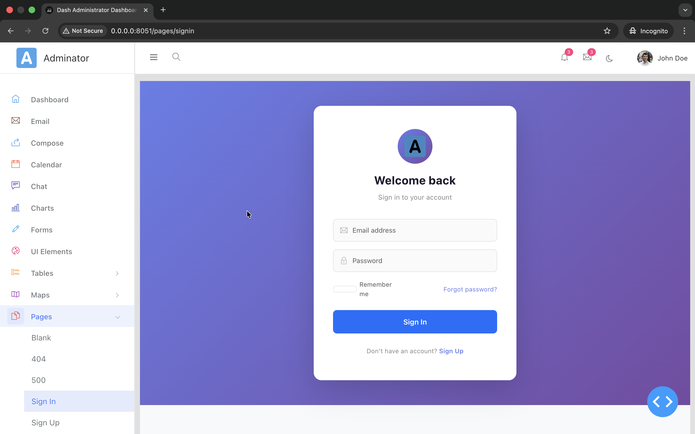

### Sign Up
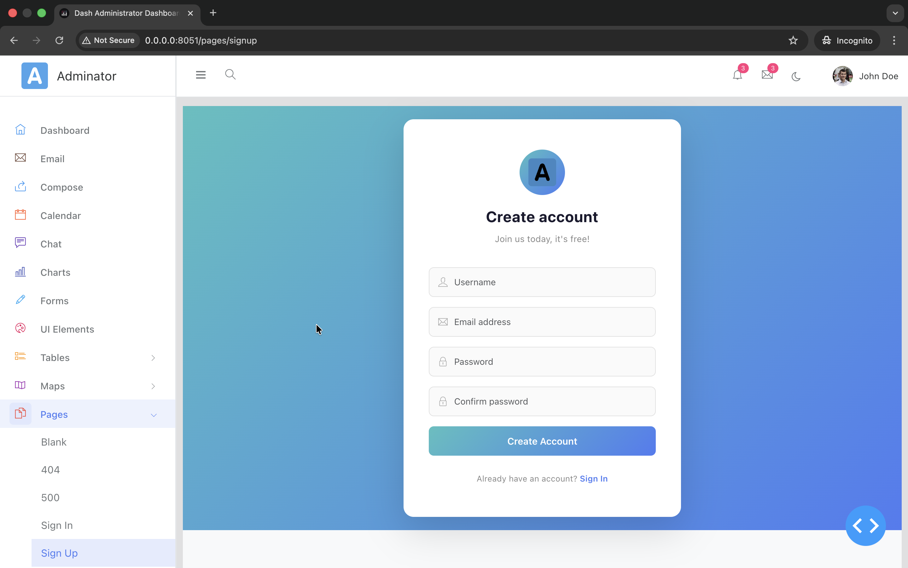

## License

This project replicates the structure and design of the open-source Adminator dashboard template by puikinsh. The Dash implementation is provided as-is for educational and development purposes.

Original Adminator: https://github.com/puikinsh/Adminator-admin-dashboard

## Contributing

Feel free to fork, modify, and improve this dashboard. Suggestions and improvements are welcome!

## Support

For issues, questions, or suggestions:
1. Check the troubleshooting section
2. Review the Dash documentation: https://dash.plotly.com/
3. Review Dash Bootstrap Components: https://www.dash-bootstrap-components.com/

## Support the Project

If you find this useful, consider buying me a coffee ☕

[](https://paypal.me/omonbudeemma)

[](https://www.linkedin.com/in/budescode)
[](https://github.com/budescode)

---

**Built with ❤️ using Dash and Dash Bootstrap Components**
