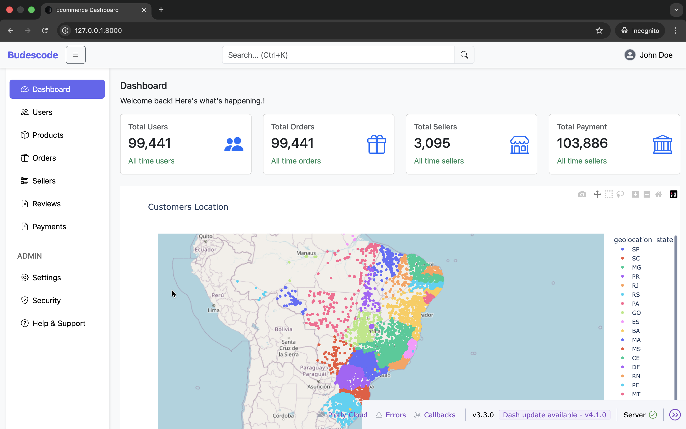
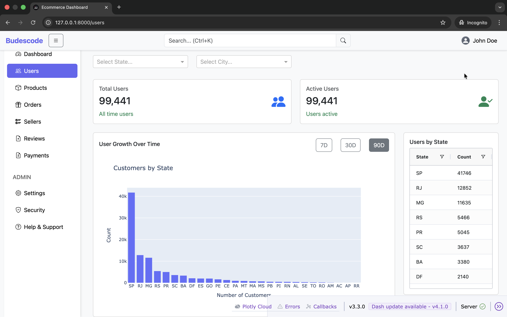
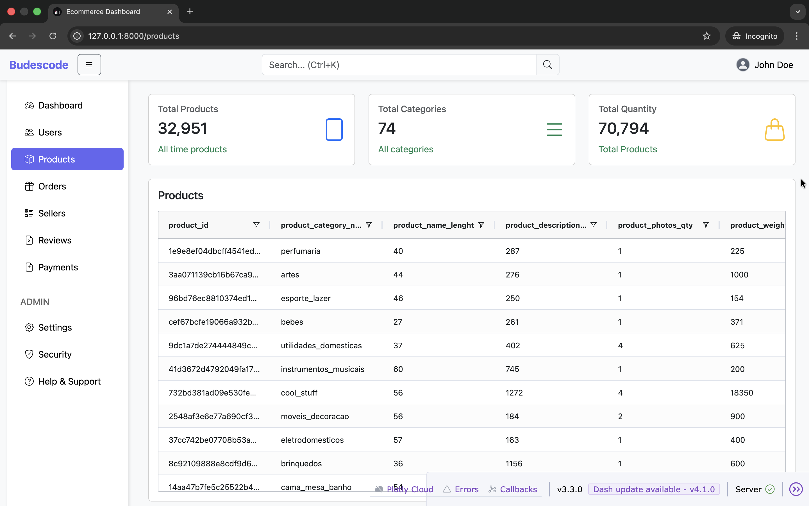
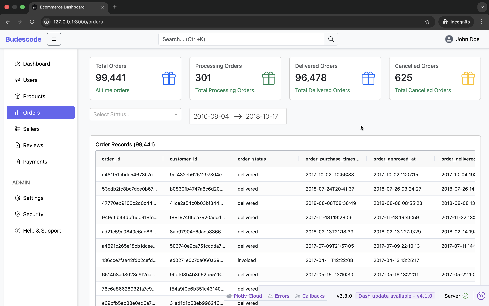
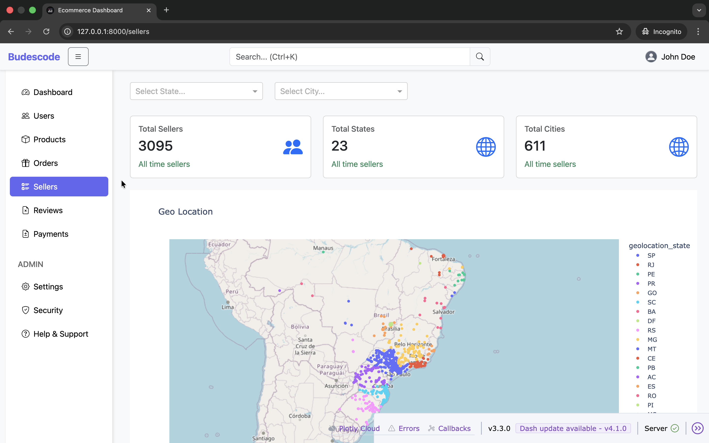
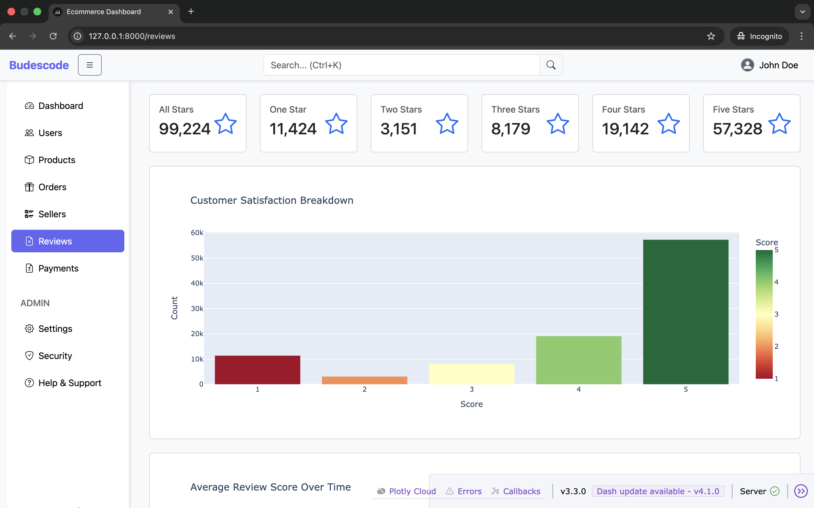
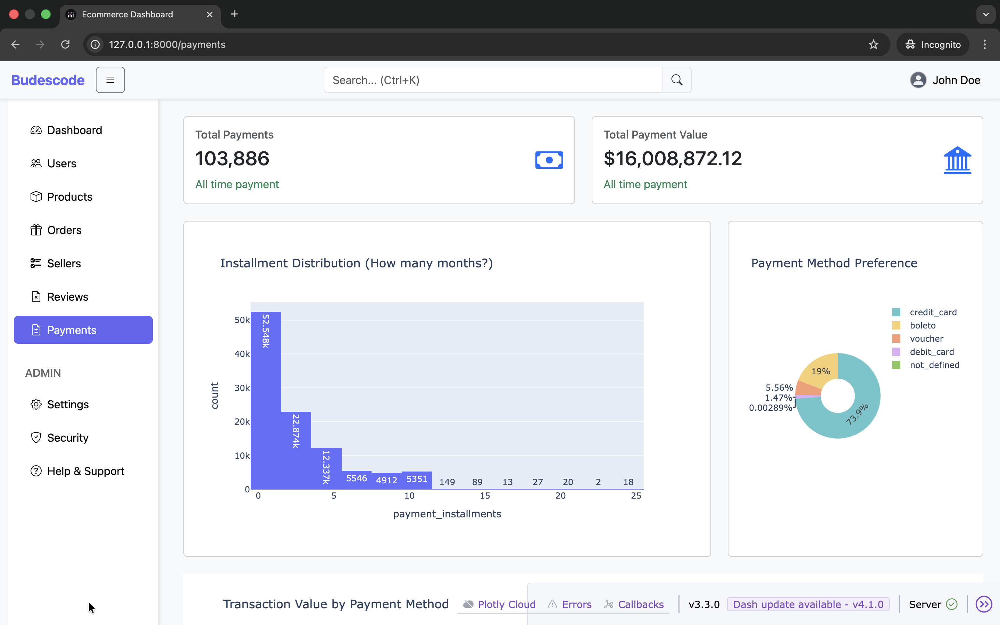
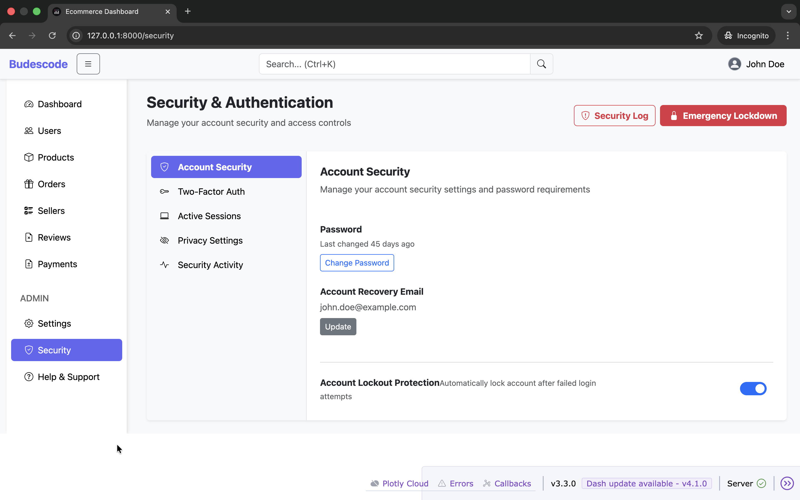
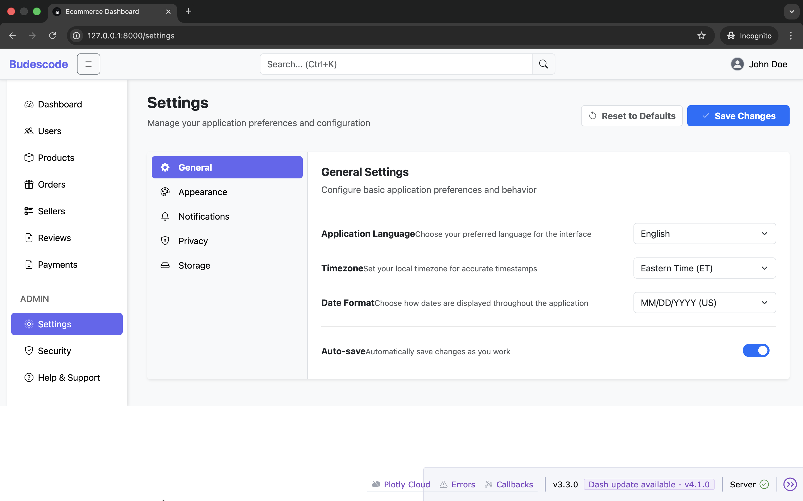
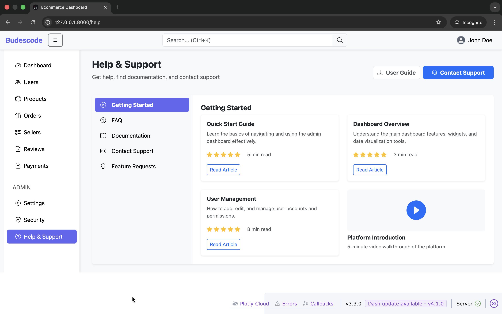

# Dash Ecommerce Admin

An e-commerce admin dashboard built with Plotly Dash, based on the open-source Colorlib Bootstrap admin template. Manages the full lifecycle of an online store — orders, products, sellers, payments, reviews, and more — powered by real Brazilian e-commerce data.

## Features

- Dashboard with KPI cards, revenue charts, and an interactive customer map
- Full page-per-module structure using Dash multi-page apps (`use_pages=True`)
- Interactive data tables via `dash-ag-grid`
- Collapsible sidebar with a navbar toggle
- Bootstrap Icons throughout
- Real dataset: Brazilian E-commerce (Olist) — customers, orders, products, sellers, payments, reviews, geolocation

## Installation

**Prerequisites:** Python 3.13+

```bash
cd dash-ecommerce-admin
python -m venv .venv
source .venv/bin/activate  # Windows: .venv\Scripts\activate
pip install -r requirements.txt
python app.py
# → http://localhost:8053
```

### Production Deployment

For deployment, see the official Dash deployment guide: https://dash.plotly.com/deployment

## Project Structure

```
dash-ecommerce-admin/
├── pages/
│   ├── navbar_h.py
│   ├── sidebar.py
│   ├── dashboard.py
│   ├── users.py
│   ├── products.py
│   ├── orders.py
│   ├── sellers.py
│   ├── reviews.py
│   ├── payments.py
│   ├── messages.py
│   ├── files.py
│   ├── calendar.py
│   ├── geo_location.py
│   ├── security.py
│   ├── settings.py
│   └── help_support.py
├── config/
│   ├── constants.py
│   └── helpers.py
├── data/
│   ├── fortune500.csv
│   ├── revenue_analytics.csv
│   └── raw/
│       ├── customers.csv
│       ├── geolocation.csv
│       ├── order_items.csv
│       ├── order_payments.csv
│       ├── order_reviews.csv
│       ├── orders.csv
│       ├── products.csv
│       ├── product_category_name_translation.csv
│       └── sellers.csv
├── assets/
│   ├── sidebar.css
│   ├── images/
│   │   ├── logo.png
│   │   ├── avatar-placeholder.svg
│   │   └── product-placeholder.svg
│   └── icons/
│       ├── favicon.png
│       └── favicon.svg
├── notebooks/
│   └── clean_data.ipynb
├── app.py
├── requirements.txt
├── pyproject.toml
└── uv.lock
```

## Pages & Routes

| Page | Route | Description |
|------|-------|-------------|
| Dashboard | `/` | KPI cards, revenue chart, customer map |
| Users | `/users` | Customer list with AG Grid |
| Products | `/products` | Product catalog with filters |
| Orders | `/orders` | Order list and status breakdown |
| Sellers | `/sellers` | Seller directory with geo map |
| Reviews | `/reviews` | Customer review scores and comments |
| Payments | `/payments` | Payment method breakdown and totals |
| Messages | `/messages` | Message inbox (placeholder) |
| Files | `/files` | File manager (placeholder) |
| Calendar | `/calendar` | Calendar (placeholder) |
| Geo Location | `/geo-location` | Interactive customer location map |
| Security | `/security` | Security settings panel |
| Settings | `/settings` | Account and app settings |
| Help & Support | `/help` | FAQ and support contact |

## Dependencies

| Package | Purpose |
|---------|---------|
| `dash` | Web framework & multi-page routing |
| `dash-bootstrap-components` | Bootstrap 5 UI components |
| `dash-ag-grid` | Interactive data tables |
| `pandas` | Data loading and manipulation |

## Dataset

This dashboard uses the [Olist Brazilian E-Commerce dataset](https://www.kaggle.com/datasets/olistbr/brazilian-ecommerce) — a real-world dataset of ~100K orders from 2016–2018. The CSV files are not included in this repo due to size.

**To set up the data:**

1. Download the dataset from [Kaggle](https://www.kaggle.com/datasets/olistbr/brazilian-ecommerce)
2. Place the files in the existing `data/raw/` folder and rename them as follows:

| Kaggle filename | Rename to |
|----------------|-----------|
| `olist_customers_dataset.csv` | `customers.csv` |
| `olist_geolocation_dataset.csv` | `geolocation.csv` |
| `olist_order_items_dataset.csv` | `order_items.csv` |
| `olist_order_payments_dataset.csv` | `order_payments.csv` |
| `olist_order_reviews_dataset.csv` | `order_reviews.csv` |
| `olist_orders_dataset.csv` | `orders.csv` |
| `olist_products_dataset.csv` | `products.csv` |
| `olist_sellers_dataset.csv` | `sellers.csv` |
| `product_category_name_translation.csv` | `product_category_name_translation.csv` |

The `notebooks/clean_data.ipynb` notebook documents the data preparation steps.

## Adding New Pages

1. Create `pages/new_page.py` with `register_page` and a `layout` variable
2. Add a `dbc.NavLink` entry in `pages/sidebar.py`

```python
# pages/new_page.py
from dash import register_page, html
import dash_bootstrap_components as dbc

register_page(__name__, path='/new-page', name='New Page')

layout = dbc.Container([
    html.H1("New Page"),
    # your content here
], fluid=True)
```

```python
# pages/sidebar.py — add inside dbc.Nav([...])
dbc.NavLink(
    html.Div([
        html.I(className="bi bi-star me-2"),
        html.Span("New Page")
    ], className="ms-2"),
    href="/new-page",
    className="nav-link mb-2",
    active="exact",
),
```

## Screenshots

### Dashboard


### Users


### Products


### Orders


### Sellers


### Reviews


### Payments


### Security


### Settings


### Help & Support


---

Inspired by a Bootstrap e-commerce admin template. Built with Dash by [budescode](https://github.com/budescode).

[](https://www.paypal.com/paypalme/omonbudeemma)
[](https://www.linkedin.com/in/budescode)
[](https://github.com/budescode)
