# Dash Kiaalap

A comprehensive education management system built with Plotly Dash, with inspiration from Kiaalap Bootstrap admin template. Covers the full lifecycle of an academic institution — students, professors, courses, library, departments, and more — across 50+ pages.

## Features

- Multiple dashboard views: main dashboard, analytics, widgets, events
- Full academic management — Students, Professors, Courses, Library Assets, Departments (list · add · edit · profile/info)
- Mailbox — Inbox, Compose, View
- UI components — Buttons, Alerts, Modals, Accordion
- Forms — Basic, Advanced, Password Meter, File Upload, Image Cropper
- Charts — Line, Area, Bar (via Plotly)
- Tables — Static and interactive data tables
- Developer tools — Code Editor, PDF Viewer, Tree View, Preloader, Notifications
- Maps — Interactive Maps, Data Maps
- Authentication — Login, Register, Lock, Password Recovery, 404, 500
- Dynamic breadcrumb in navbar that updates per page

## Installation

**Prerequisites:** Python 3.8+

```bash
cd dash-kiaalap
python -m venv .venv
source .venv/bin/activate  # Windows: .venv\Scripts\activate
pip install -r requirements.txt
python app.py
# → http://localhost:8050
```

**Live Demo:** https://eea22046-514c-4815-9ae2-f1693ded335a.plotly.app/

### Production Deployment

For deployment, see the official Dash deployment guide: https://dash.plotly.com/deployment

## Project Structure

```
dash-kiaalap/
├── app.py
├── requirements.txt
├── layouts/
│   ├── sidebar.py
│   ├── header.py
│   └── footer.py
├── pages/
│   ├── index.py
│   ├── analytics.py
│   ├── widgets.py
│   ├── events.py
│   ├── all_students.py
│   ├── add_student.py
│   ├── edit_student.py
│   ├── student_profile.py
│   ├── all_professors.py
│   ├── add_professor.py
│   ├── edit_professor.py
│   ├── professor_profile.py
│   ├── all_courses.py
│   ├── add_course.py
│   ├── edit_course.py
│   ├── course_info.py
│   ├── course_payment.py
│   ├── library_assets.py
│   ├── add_library_assets.py
│   ├── edit_library_assets.py
│   ├── departments.py
│   ├── add_department.py
│   ├── edit_department.py
│   ├── mailbox.py
│   ├── mailbox_compose.py
│   ├── mailbox_view.py
│   ├── buttons.py
│   ├── alerts.py
│   ├── modals.py
│   ├── accordion.py
│   ├── basic_form.py
│   ├── advance_form.py
│   ├── password_meter.py
│   ├── multi_upload.py
│   ├── images_cropper.py
│   ├── line_charts.py
│   ├── area_charts.py
│   ├── bar_charts.py
│   ├── static_table.py
│   ├── data_table.py
│   ├── code_editor.py
│   ├── preloader.py
│   ├── notifications.py
│   ├── tree_view.py
│   ├── pdf_viewer.py
│   ├── google_map.py
│   ├── data_maps.py
│   ├── login.py
│   ├── register.py
│   ├── lock.py
│   ├── password_recovery.py
│   ├── error_404.py
│   └── error_500.py
└── assets/
    └── dashboard.css
```

## Adding New Pages

1. Create `pages/new_page.py` and define a `layout` variable
2. Import it in `app.py` and add a route in `display_page`
3. Add it to `create_page_layout` call with a title

```python
# pages/new_page.py
from dash import html

layout = html.Div("New Page Content")
```

```python
# app.py — import at the top
from pages import new_page

# app.py — add inside display_page()
elif pathname == '/new-page':
    return create_page_layout(new_page.layout, 'New Page')
```

## Dependencies

| Package | Purpose |
|---------|---------|
| `dash` | Web framework & routing |
| `dash-bootstrap-components` | Bootstrap 5 UI components |
| `plotly` | Interactive charts |
| `pandas` | Data handling |

## Screenshots

### Dashboard
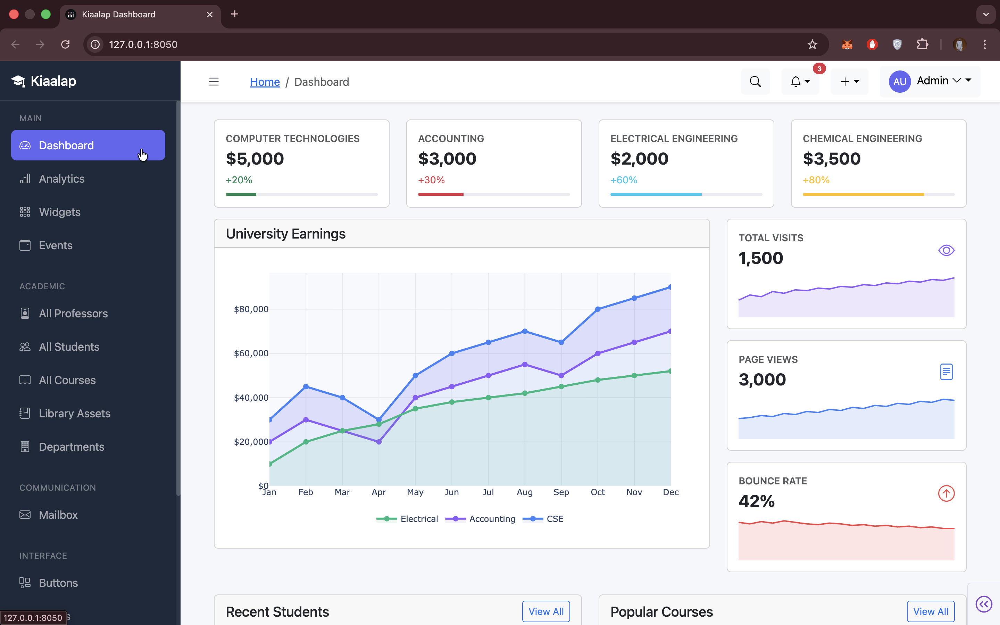

### Analytics
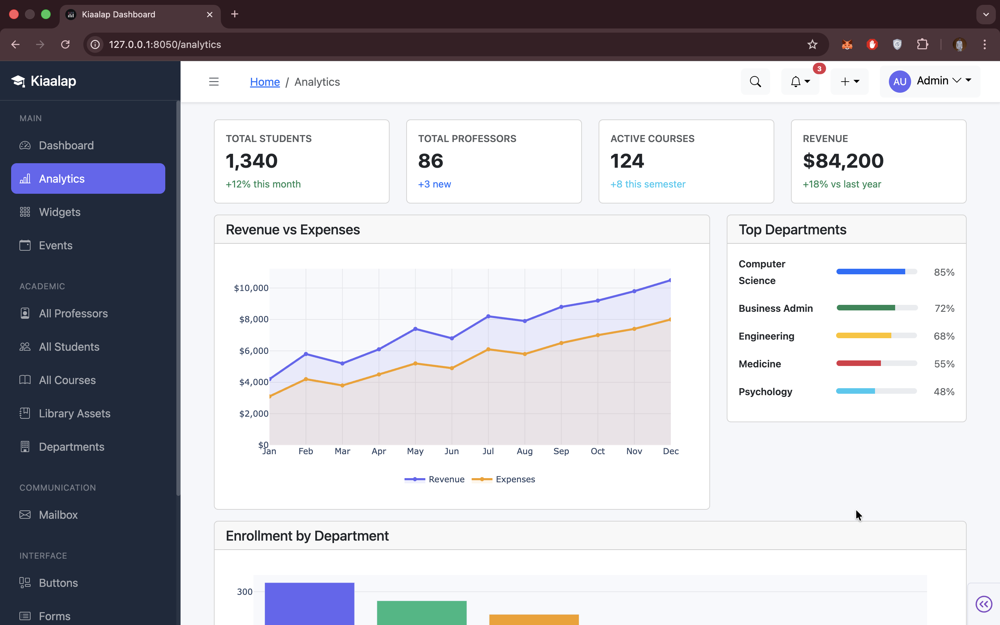

### Widgets
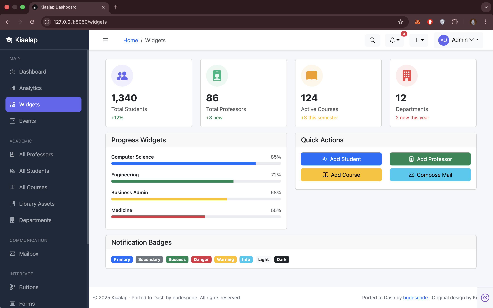

### Events
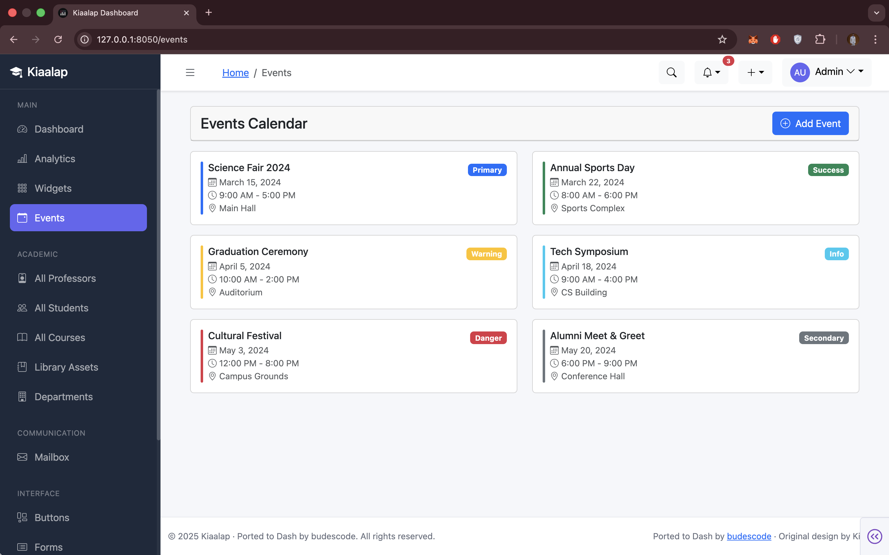

### All Students
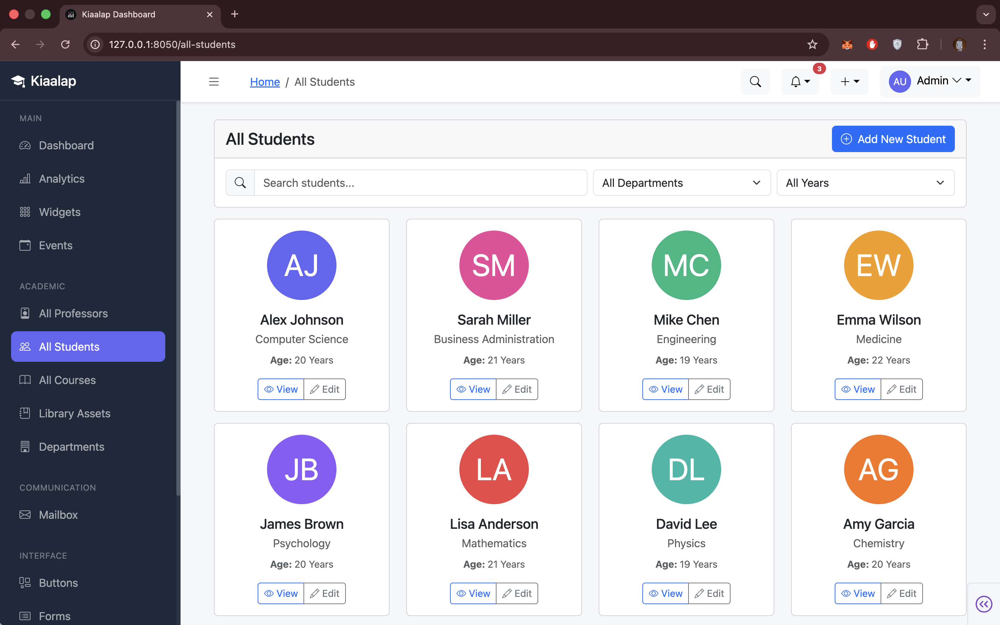

### All Professors


### All Courses
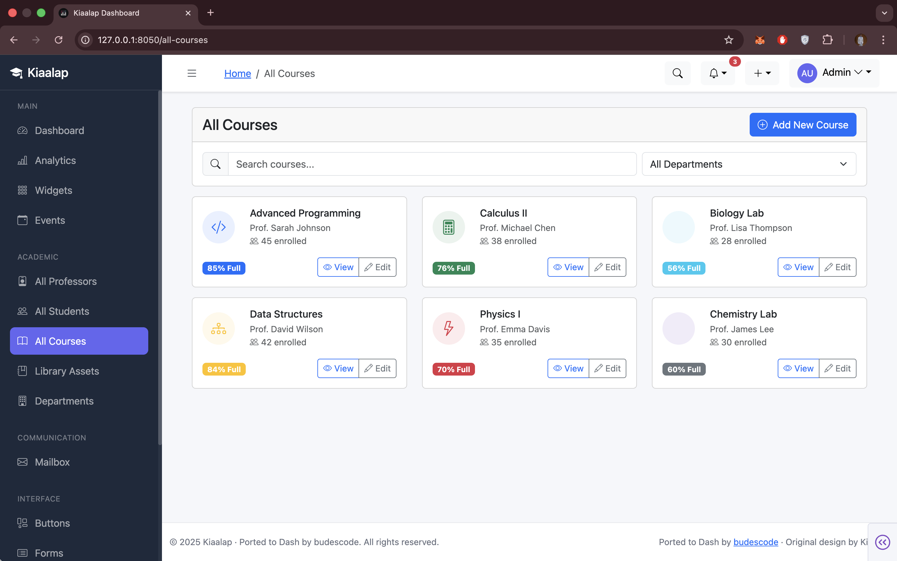

### Library Assets
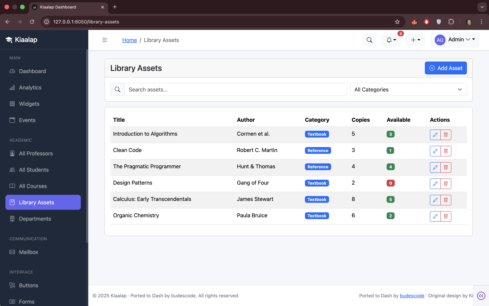

### Departments
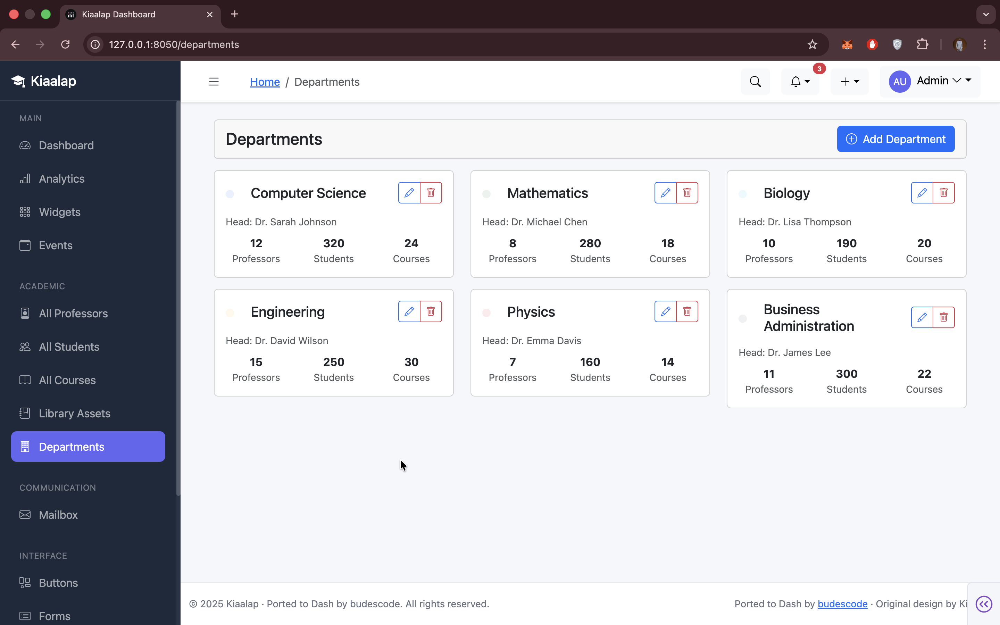

### Mailbox
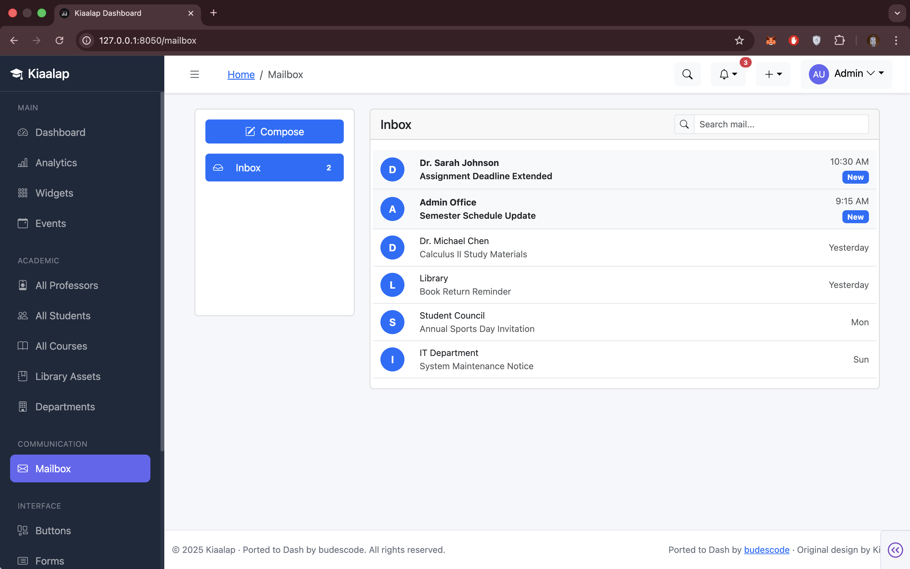

### Buttons
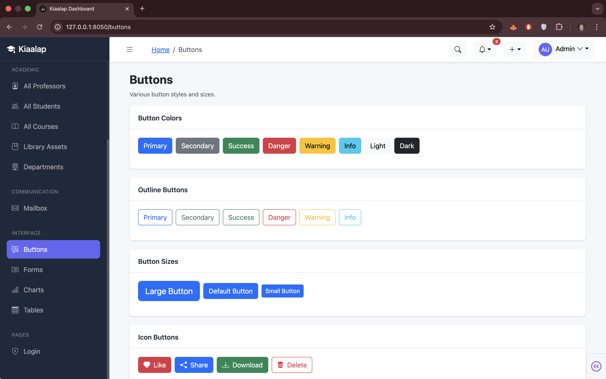

### Forms
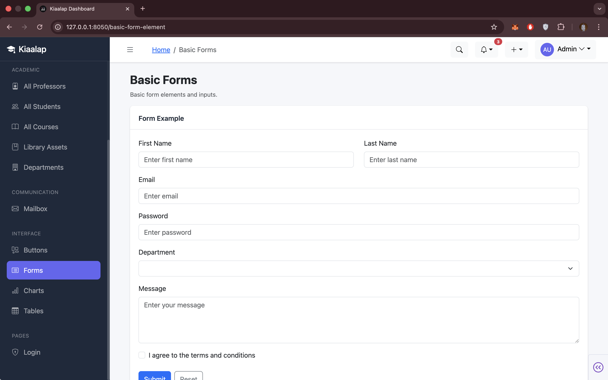

### Charts
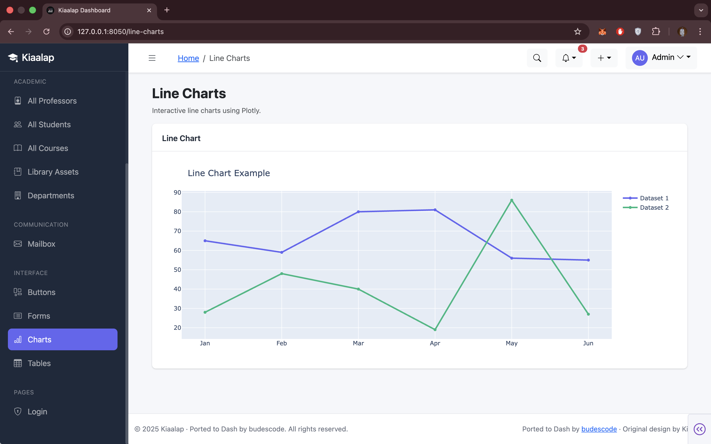

### Tables
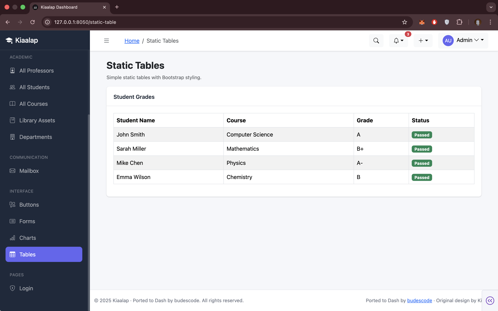

---

Inspired by the Kiaalap Bootstrap admin template. Built with Dash by [budescode](https://github.com/budescode).

[](https://www.paypal.com/paypalme/omonbudeemma)
[](https://www.linkedin.com/in/budescode)
[](https://github.com/budescode)
