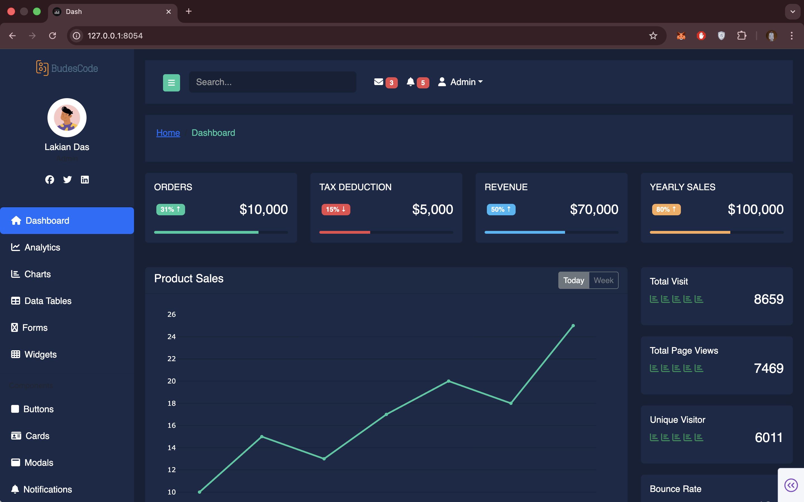
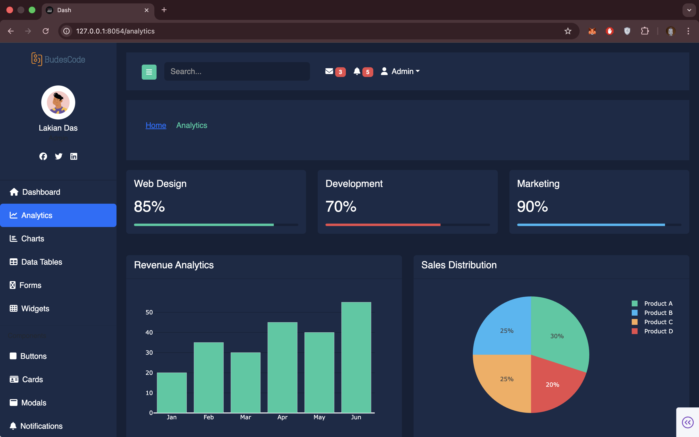
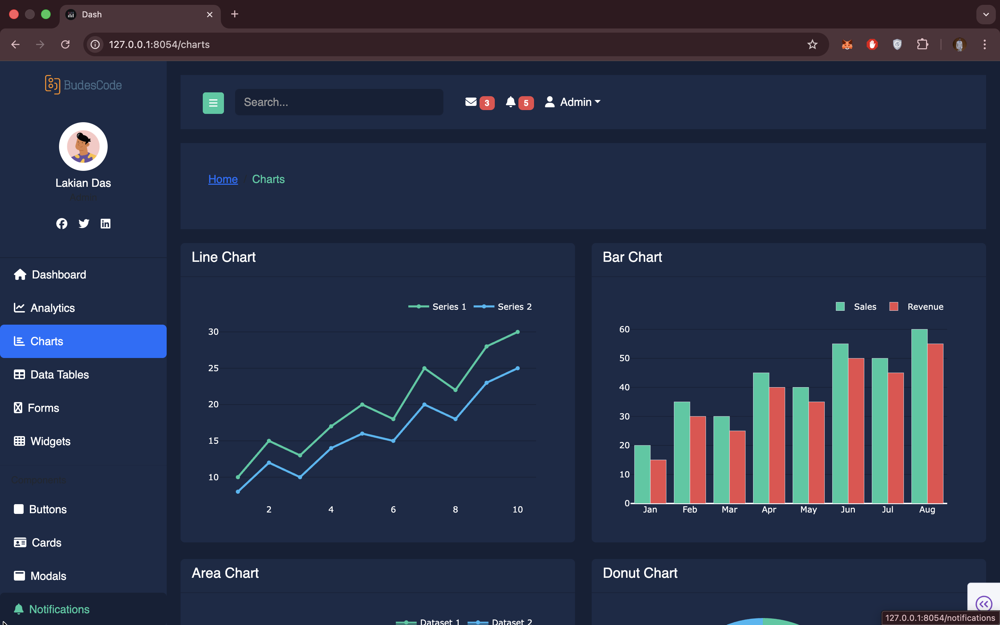
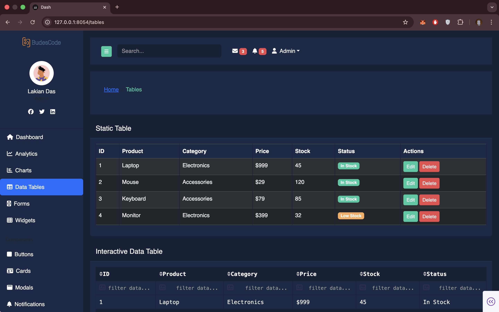
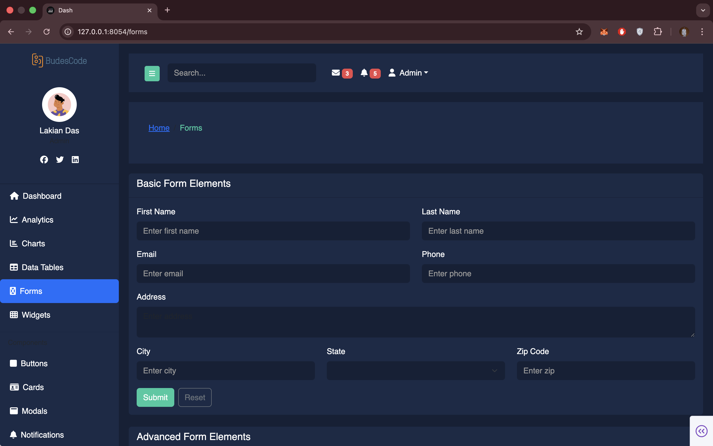
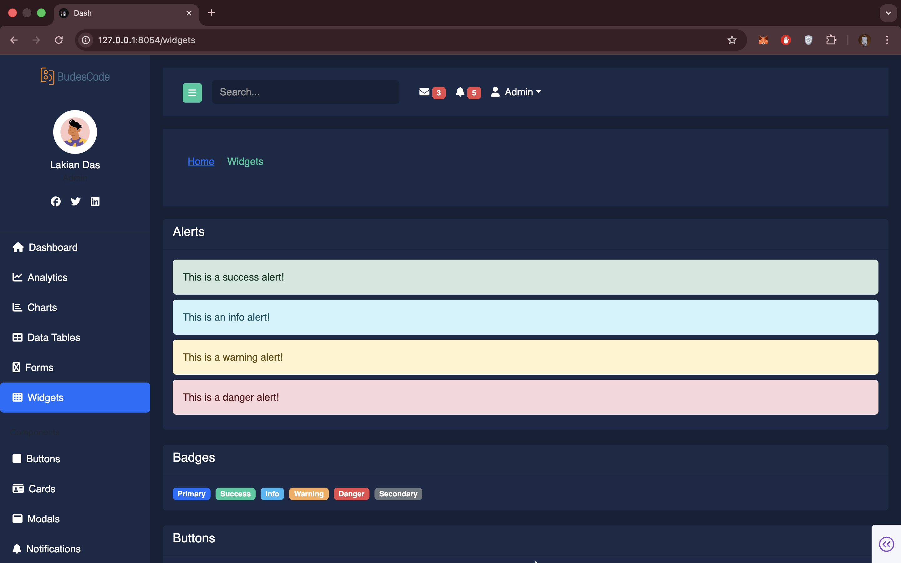
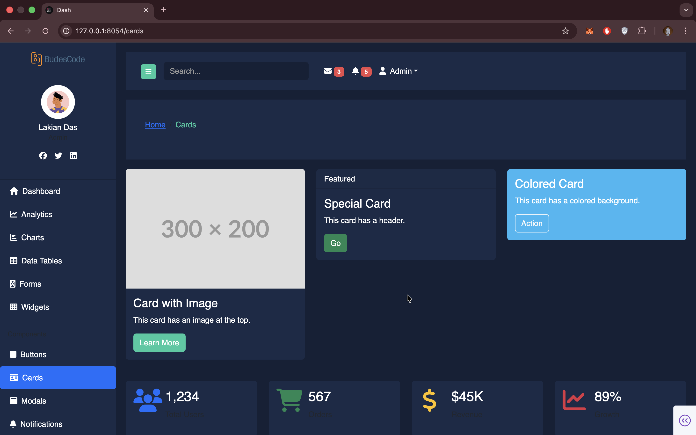
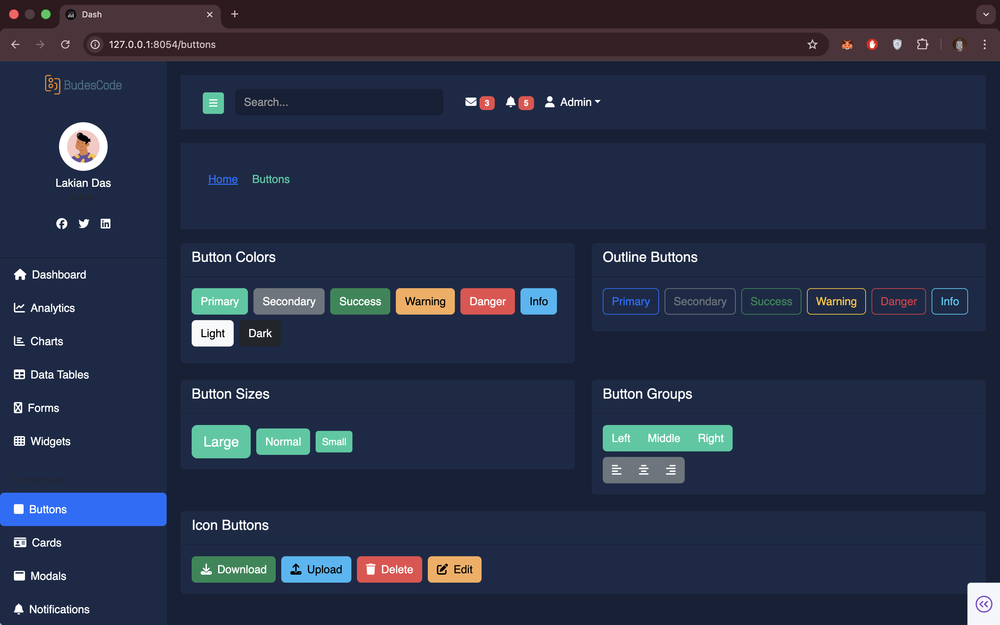
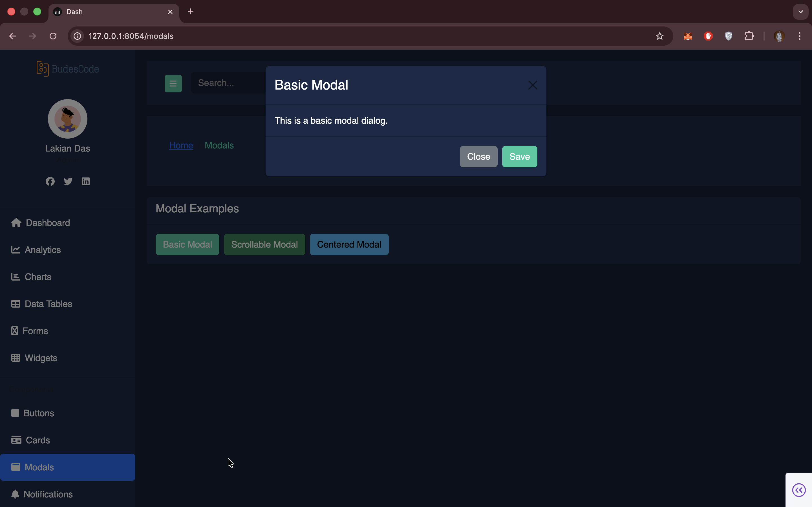
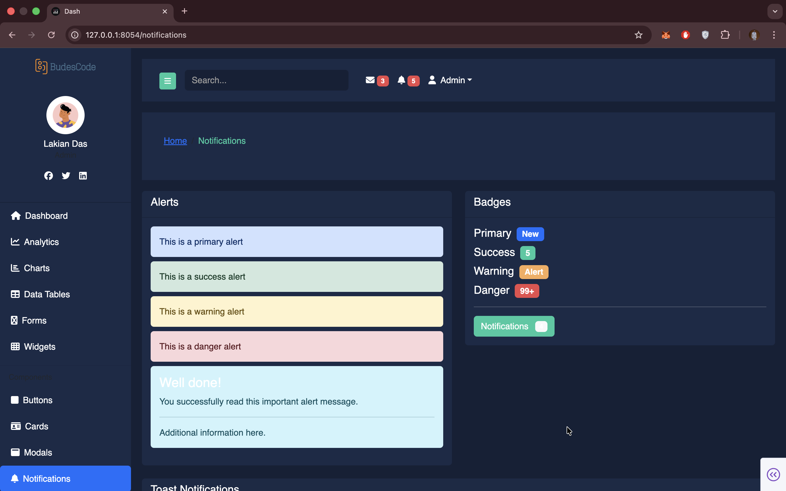

# Das -Nalika
 
A dark-themed admin dashboard built with Plotly Dash, based on the Nalika Bootstrap admin template. Designed for professional and corporate environments with a teal accent palette across 17 pages.

## Features

- Dark theme throughout — `#152036` background, `#24caa1` teal accent
- Fully built pages covering analytics, UI components, and utilities
- Interactive Plotly charts — line, bar, area, donut
- Static and interactive data tables
- Forms, modals, progress bars, notifications, calendar, maps, and more
- Responsive layout with collapsible sidebar

## Installation

**Prerequisites:** Python 3.8+

```bash
cd nalika-dash
python -m venv .venv
source .venv/bin/activate  # Windows: .venv\Scripts\activate
pip install -r requirements.txt
python app.py
# → http://localhost:8054
```

**Live Demo:** https://617c364e-d98b-4e70-97ca-60a0c04f5c69.plotly.app/

### Production Deployment

For deployment, see the official Dash deployment guide: https://dash.plotly.com/deployment

## Project Structure

```
nalika-dash/
├── app.py
├── requirements.txt
├── components/
│   ├── sidebar.py
│   └── navbar.py
├── pages/
│   ├── dashboard.py
│   ├── analytics.py
│   ├── charts.py
│   ├── tables.py
│   ├── forms.py
│   ├── widgets.py
│   ├── cards.py
│   ├── buttons.py
│   ├── modals.py
│   ├── progress.py
│   ├── notifications.py
│   ├── calendar.py
│   ├── tabs_accordions.py
│   ├── maps.py
│   ├── mailbox.py
│   ├── profile.py
│   └── login.py
└── assets/
    └── custom.css
```

## Pages & Routes

| Page | Route | Description |
|------|-------|-------------|
| Dashboard | `/` | KPI cards, sales chart, analytics metrics |
| Analytics | `/analytics` | Progress bars, revenue chart, metrics table |
| Charts | `/charts` | Line, bar, area, donut charts |
| Tables | `/tables` | Static table, interactive data table, bordered table |
| Forms | `/forms` | Basic and advanced form elements, input groups |
| Widgets | `/widgets` | Alerts, badges, buttons, progress bars, spinners |
| Cards | `/cards` | Card variants with image, header, colored background |
| Buttons | `/buttons` | Button styles, sizes, and variants |
| Modals | `/modals` | Modal dialogs — sm, md, lg, xl |
| Progress | `/progress` | Progress bar styles and animations |
| Notifications | `/notifications` | Notification styles and examples |
| Calendar | `/calendar` | Calendar view |
| Tabs & Accordions | `/tabs-accordions` | Tabbed content and accordion panels |
| Maps | `/maps` | Interactive map |
| Mailbox | `/mailbox` | Inbox layout |
| Profile | `/profile` | User profile page |
| Login | `/login` | Login form |

## Color Scheme

| Token | Value |
|-------|-------|
| Background | `#152036` |
| Card background | `#1b2a47` |
| Accent | `#24caa1` |
| Danger | `#eb4b4b` |
| Info | `#2eb7f3` |
| Warning | `#f8ac59` |
| Text | `#ffffff` |

## Dependencies

| Package | Purpose |
|---------|---------|
| `dash` | Web framework & routing |
| `dash-bootstrap-components` | Bootstrap 5 UI components |
| `plotly` | Interactive charts |
| `pandas` | Data handling |

## Screenshots

### Dashboard


### Analytics


### Charts


### Tables


### Forms


### Widgets


### Cards


### Buttons


### Modals


### Notifications


---

Inspired by the Nalika Bootstrap admin template. Built with Dash by [budescode](https://github.com/budescode).

[](https://www.paypal.com/paypalme/omonbudeemma)
[](https://www.linkedin.com/in/budescode)
[](https://github.com/budescode)
