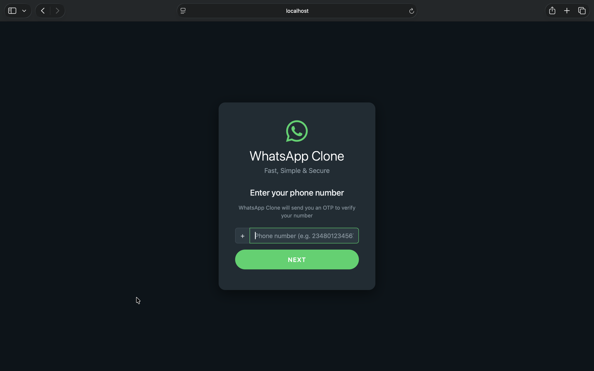
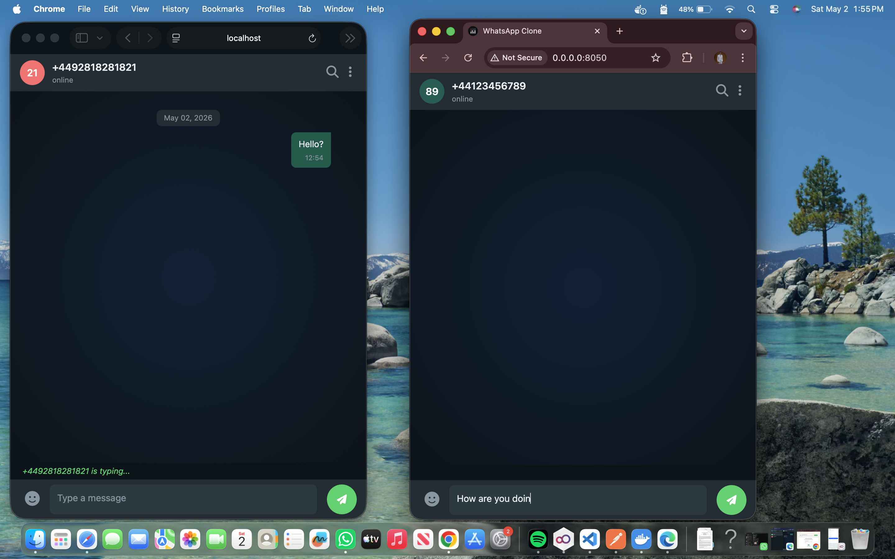
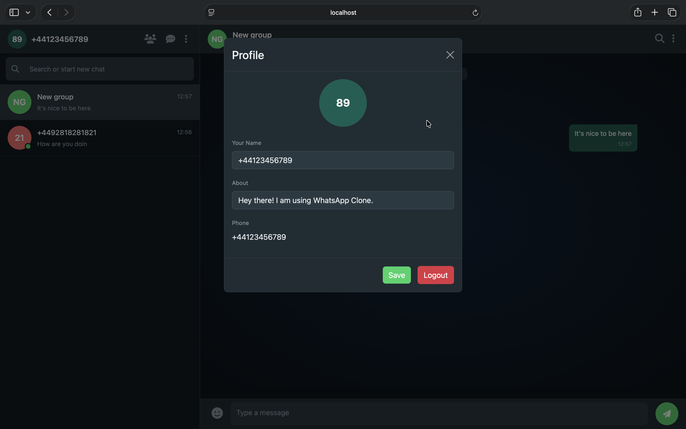

# WhatsApp Clone

A modern, real-time messaging application built with Dash, Flask-SocketIO, and PostgreSQL. Experience instant messaging with a clean, intuitive interface inspired by WhatsApp Web.

## Features

🔐 **Authentication**
- OTP-based phone number verification
- Secure session token management
- Device-based login/logout

💬 **Messaging**
- Real-time one-on-one conversations
- Group chat support with custom member management
- Message typing indicators
- Message deletion capability
- Timestamp-based message ordering

👥 **User Management**
- User profiles with phone number identification
- Online/offline status tracking
- User search functionality
- Contact list management

🎨 **User Interface**
- Clean, modern dark theme (WhatsApp Web inspired)
- Responsive design
- Intuitive sidebar with conversation list
- Real-time message updates via WebSockets
- Search conversations feature
- Mobile-friendly interface

⚡ **Real-time Features**
- WebSocket-based instant messaging (Socket.IO)
- Live typing indicators
- Instant status updates
- Efficient message polling with memory stores

## Screenshots

### Login & OTP Verification


### Main Chat Interface


### Group Chat


### User Profile


## Installation

**Prerequisites:** 
- Python 3.9+
- PostgreSQL
- Docker & Docker Compose (optional)

### Option 1: Docker Compose (Recommended)

```bash
cd whatsapp-clone
docker compose up
# → http://localhost:8050
```

### Option 2: Manual Setup

1. **Navigate to the project directory:**
   ```bash
   cd whatsapp-clone
   ```

2. **Create and activate a virtual environment:**
   ```bash
   python -m venv .venv
   source .venv/bin/activate  # Windows: .venv\Scripts\activate
   ```

3. **Install dependencies:**
   ```bash
   pip install -r requirements.txt
   ```

4. **Set up environment variables:**
   ```bash
   cp .env.example .env
   # Edit .env with your database and Redis configuration
   ```

5. **Initialize the database:**
   ```bash
   python -c "from app.database import init_db; init_db()"
   ```

6. **Run the application:**
   ```bash
   python run.py
   ```

The application will be available at `http://localhost:8050`

## Project Structure

```
whatsapp-clone/
├── app/
│   ├── __init__.py
│   ├── api/
│   │   ├── __init__.py
│   │   ├── auth.py              # Authentication endpoints
│   │   └── messages.py          # Message endpoints
│   ├── callbacks/
│   │   ├── __init__.py
│   │   ├── auth.py              # Auth-related callbacks
│   │   └── chat.py              # Chat-related callbacks
│   ├── layouts/
│   │   ├── __init__.py
│   │   ├── auth.py              # Authentication layout
│   │   ├── chat.py              # Chat layout
│   │   └── main.py              # Main app layout
│   ├── assets/
│   │   └── style.css            # Custom styles
│   ├── config.py                # Configuration settings
│   ├── database.py              # Database initialization
│   ├── models.py                # SQLAlchemy models (User, Conversation, Message)
│   ├── otp_service.py           # OTP generation and verification
│   ├── redis_client.py          # Redis client for session/OTP storage
│   ├── server.py                # Flask & Dash app creation
│   └── socket_events.py         # Socket.IO event handlers
├── screenshots/
│   ├── login.png
│   ├── chats.png
│   ├── groupchat.png
│   └── profile.png
├── uploads/                     # User profile images
├── .env.example                 # Environment variables template
├── docker-compose.yml           # Docker composition
├── Dockerfile                   # Docker image definition
├── init.sql                     # Database initialization script
├── requirements.txt             # Python dependencies
├── run.py                       # Application entry point
└── README.md
```

## API Endpoints

### Authentication
| Method | Endpoint | Description |
|--------|----------|-------------|
| POST | `/api/auth/send-otp` | Send OTP to phone number |
| POST | `/api/auth/verify-otp` | Verify OTP and create session |
| GET | `/api/auth/me` | Get current user info |
| POST | `/api/auth/logout` | Logout and clear session |

### Messages
| Method | Endpoint | Description |
|--------|----------|-------------|
| GET | `/api/messages/conversations` | Fetch user's conversations |
| GET | `/api/messages/conversation/<id>` | Fetch messages in conversation |
| POST | `/api/messages/send` | Send a message |
| POST | `/api/messages/delete/<id>` | Delete a message |
| GET | `/api/messages/search` | Search conversations |

## Socket.IO Events

### Client → Server
- `connect` - User connects to socket
- `typing_start` - User starts typing
- `typing_stop` - User stops typing
- `message_send` - Send message via socket (real-time)

### Server → Client
- `message_received` - New message notification
- `user_typing` - User typing indicator
- `user_stopped_typing` - Typing stopped notification
- `conversation_updated` - Conversation list update

## Database Schema

### Users Table
- `id` - Primary key
- `phone_number` - Unique phone number
- `display_name` - User's display name
- `profile_image` - Profile image URL
- `created_at` - Account creation timestamp
- `last_seen` - Last activity timestamp

### Conversations Table
- `id` - Primary key
- `name` - Conversation name (for groups)
- `is_group` - Boolean: group or direct
- `created_by` - Creator user ID
- `created_at` - Creation timestamp

### Messages Table
- `id` - Primary key
- `conversation_id` - Foreign key to conversations
- `sender_id` - Foreign key to users
- `content` - Message content
- `is_deleted` - Soft delete flag
- `created_at` - Message timestamp

## Technology Stack

- **Frontend:** Plotly Dash, Dash Bootstrap Components
- **Backend:** Flask, Flask-SocketIO (WebSockets)
- **Database:** PostgreSQL
- **Caching/Sessions:** Redis
- **Server:** Eventlet WSGI
- **Deployment:** Docker & Docker Compose

## Configuration

Edit `.env` file to customize:

```env
# Database
DATABASE_URL=postgresql://user:password@db:5432/whatsapp_clone

# Redis
REDIS_URL=redis://redis:6379/0

# Security
SECRET_KEY=your-secret-key-here

# OTP (Dev Mode)
OTP_EXPIRY=300  # OTP validity in seconds
DEV_MODE=true   # Show OTP in UI for testing
```

## Production Deployment

For deployment, consider:

1. **Gunicorn + Nginx** - Traditional WSGI deployment
2. **Docker to cloud** - Heroku, AWS, DigitalOcean, or Fly.io
3. **PaaS solutions** - Plotly Dash Enterprise

See the official Dash deployment guide: https://dash.plotly.com/deployment

## Known Limitations

- File sharing not yet implemented
- Media messages (images, videos) coming soon
- End-to-end encryption not yet implemented
- Single device per user (no multi-device sync)

## Future Enhancements

- 🖼️ Image and file sharing
- 🎥 Voice/Video calls
- 🔐 End-to-end encryption
- 📱 Mobile app (React Native)
- 🌙 Automatic dark/light theme
- 🔔 Browser notifications
- ✨ Message reactions and stickers

## Contributing

Contributions are welcome! Feel free to:
- Report bugs
- Suggest new features
- Submit pull requests

## License

This project is open source and available under the MIT License.

## Support

For issues or questions, please open an issue in the repository or contact the developer.

---

Built with ❤️ using Plotly Dash
